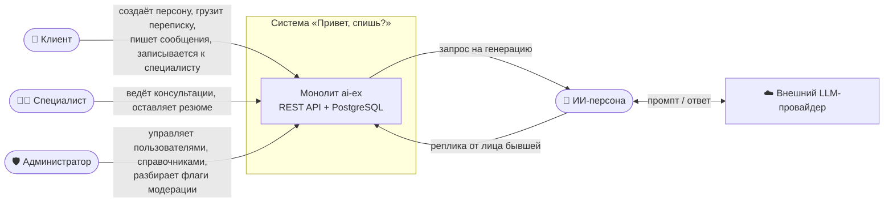
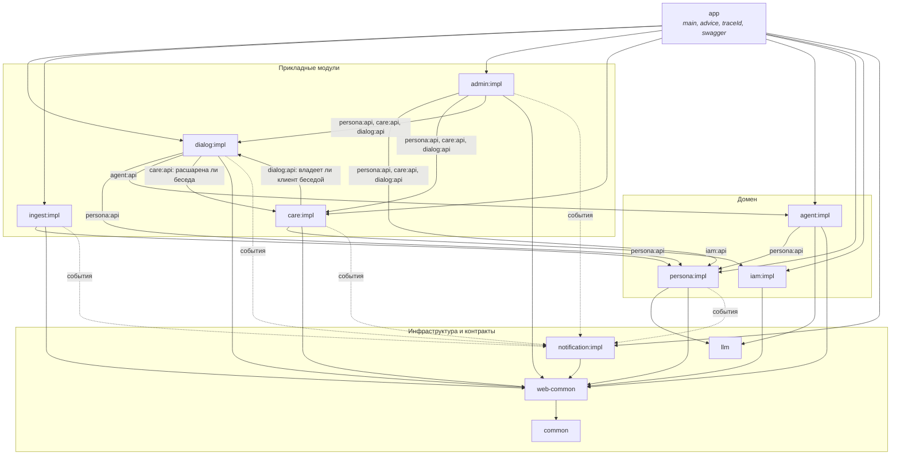
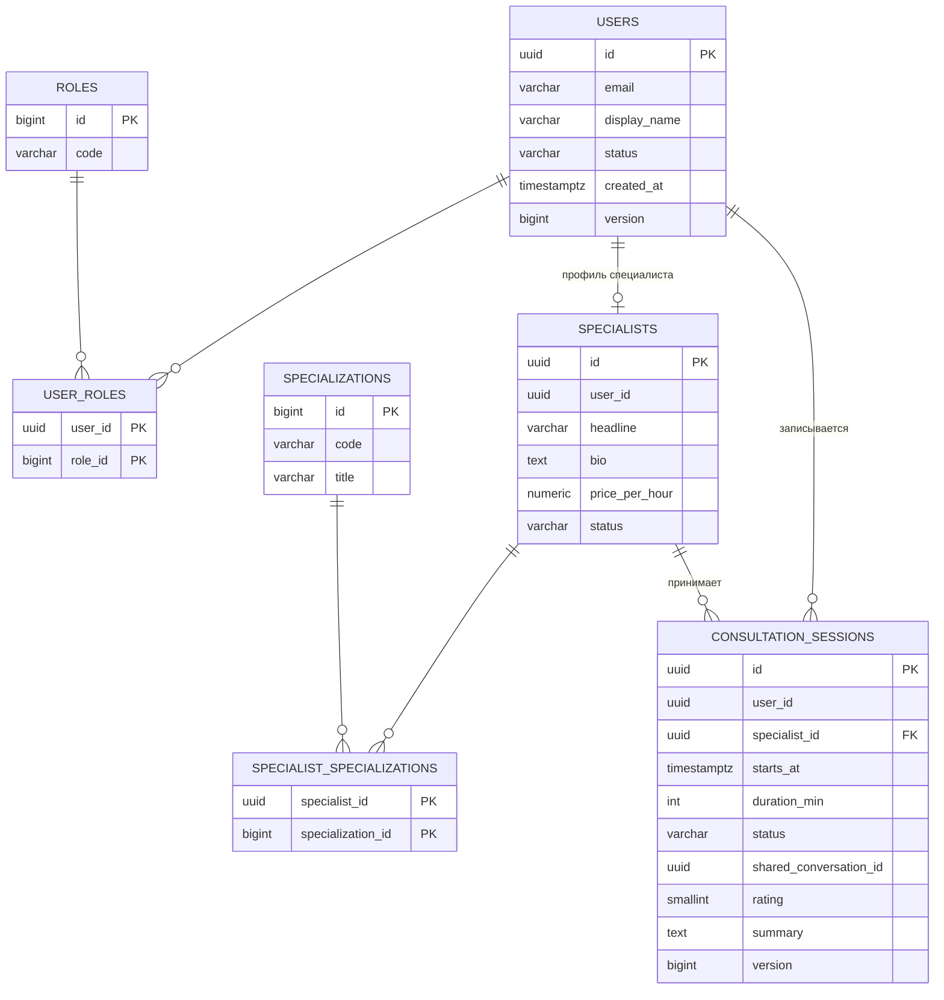
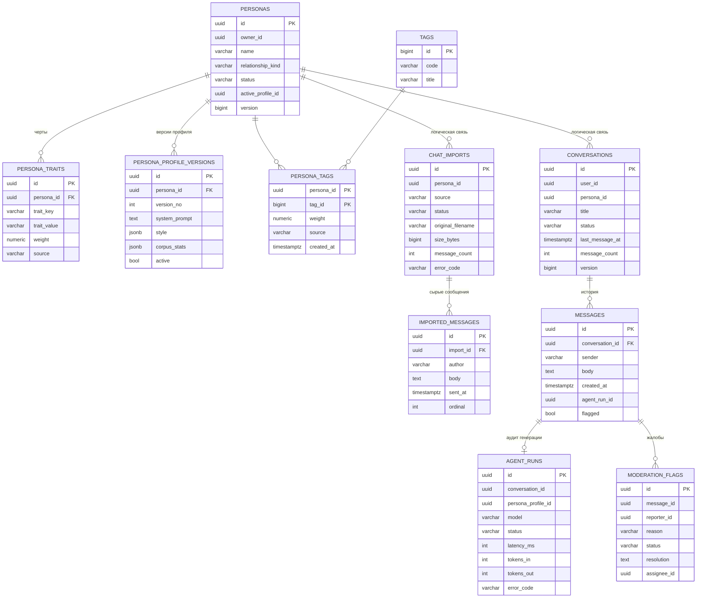
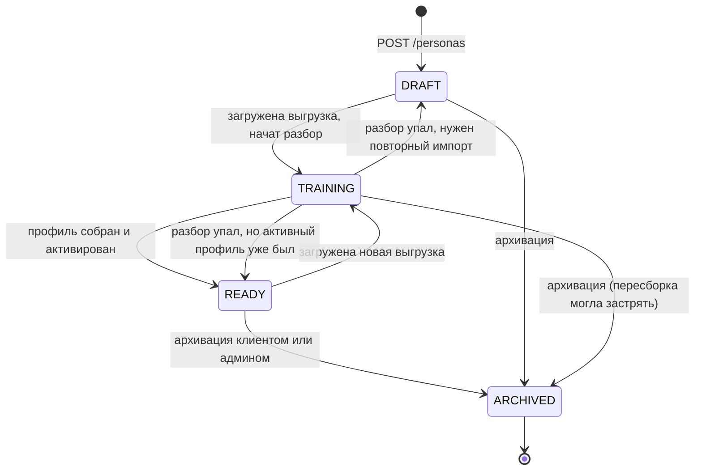
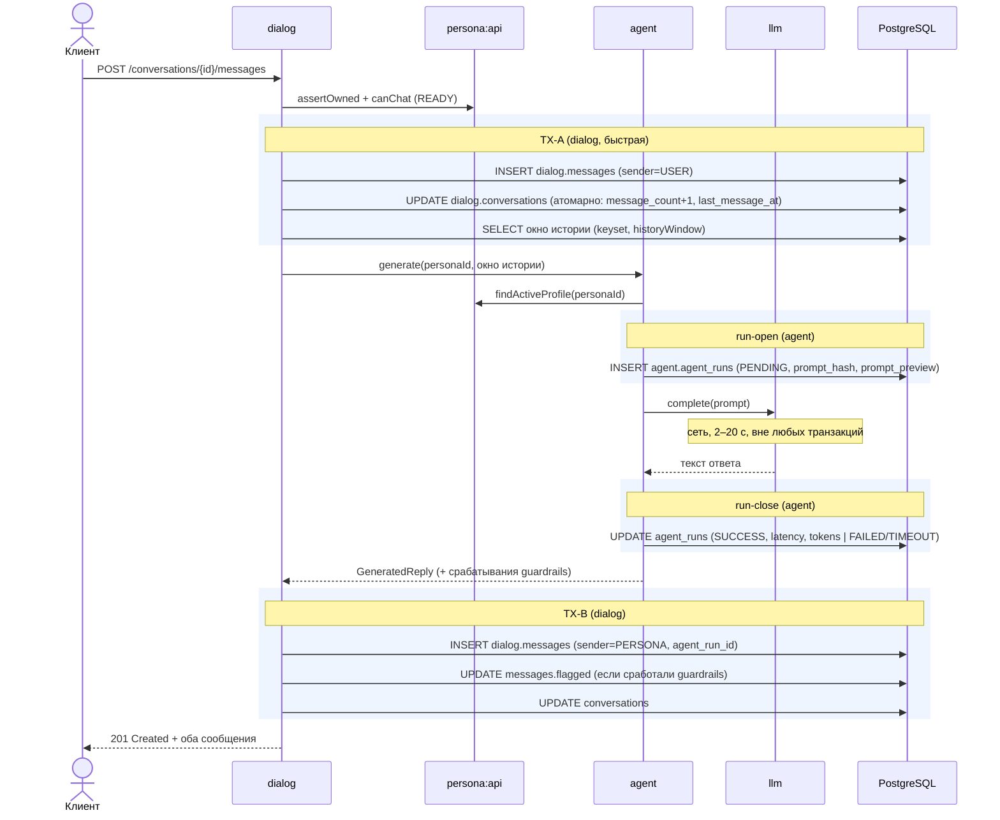

# «Привет, спишь?» — архитектура и распределение работ

**Лабораторная работа №1 · монолит на Spring Boot + Kotlin**

> **Статус документа:** v1.0 — реализовано в коде лабораторной №1. Изменения относительно черновика v0.9 собраны в [§18](#18-отклонения-от-черновика-v09); расхождение кода и документа по-прежнему считается дефектом.
> **Утверждают:** три участника команды + преподаватель
> **Кодовое имя проекта:** `ai-ex` · корневой пакет `ru.itmo.aiex`
> **Рабочее название продукта:** «Привет, спишь?»

| Роль в команде | Участник | Зона ответственности |
| --- | --- | --- |
| **A — Платформа** | _вписать имя_ | сборка, инфраструктура, `common`, `iam`, `care`, `admin` |
| **B — Персона** | _вписать имя_ | `persona`, `ingest` |
| **C — Диалог** | _вписать имя_ | `dialog`, `agent`, `llm`, `notification` |

---

## 1. О продукте в двух абзацах

Пользователь выгружает историю переписки с бывшим партнёром, загружает её в систему и получает **цифровую персону** — ИИ-собеседника, который перенял стиль речи, привычки и характер этого человека. Дальше пользователь общается с этой персоной в обычном чате: пишет «привет, спишь?» в три часа ночи и получает ответ в том же тоне, в каком получал бы его раньше.

Сценарий эмоционально нагруженный, поэтому в системе есть второй контур — **пул специалистов** (психологов/кураторов), к которым пользователь может записаться на консультацию, и **администратор**, который следит за безопасностью контента и управляет доступами. Это даёт нам естественные четыре актора и естественную декомпозицию на сервисы к лабораторной №2.

---

## 2. Глоссарий

Термины из этого списка используются во всём коде и во всей документации в одном и том же значении. Русское слово — для разговоров, английское — для кода.

| Термин | В коде | Что это |
| --- | --- | --- |
| Персона | `Persona` | Цифровой образ конкретного человека из прошлого пользователя. Принадлежит ровно одному пользователю. |
| Черта | `PersonaTrait` | Одна характеристика персоны: `jealousy = 0.8`, `reply_speed = slow`. |
| Тег | `Tag` | Ярлык из общего справочника: «холодная», «ревнивая», «пишет капсом». |
| Корпус | `CorpusSnapshot` | Выжимка из загруженной переписки: статистика + характерные примеры фраз. Не вся переписка целиком. |
| Профиль | `PersonaProfileVersion` | Версионированная «карточка личности»: то, из чего собирается системный промпт. Персона без активного профиля общаться не умеет. |
| Импорт | `ChatImport` | Один загруженный файл выгрузки + результат его разбора. |
| Беседа | `Conversation` | Диалог «пользователь ↔ персона». |
| Прогон агента | `AgentRun` | Аудит-запись одного обращения к LLM: промпт, модель, задержка, статус, ошибка. |
| Консультация | `ConsultationSession` | Запись пользователя к специалисту на конкретный слот. |
| Флаг | `ModerationFlag` | Сигнал о проблемном контенте, попадающий в очередь администратора. |

---

## 3. Акторы

Требование «минимум 4 актора» закрыто. Три актора — люди, один — системный.



### 3.1. Клиент — `USER`

Главный актор, вокруг него строится всё остальное.

- регистрируется (в лаб. 1 — свободно, в лаб. 3 — только через супервайзера);
- создаёт, редактирует, архивирует свои персоны;
- загружает выгрузки переписки и следит за статусом разбора;
- ведёт беседы с персоной, читает историю с бесконечной прокруткой;
- смотрит каталог специалистов и записывается на свободный слот;
- жалуется на ответ персоны — создаёт флаг модерации;
- **видит только свои данные.** Чужая персона для него не существует: `404`, а не `403`, чтобы не раскрывать факт существования объекта.

### 3.2. ИИ-персона — `AI_PERSONA`

Системный актор. Не человек, но самостоятельный участник диалога, и это принципиально: у него есть собственное состояние (`PersonaStatus`), собственные ограничения (окно истории, бюджет токенов, таймаут), собственный аудит-след (`agent_runs`) и собственные отказы (не может отвечать, если профиль не готов).

- отвечает только в рамках одной беседы и только от лица одной персоны;
- получает на вход **профиль персоны + окно последних сообщений**, больше ничего;
- не знает, кто такой пользователь, какой у него email и есть ли у него психолог;
- каждый её ответ — отдельная строка в `messages` с `sender = PERSONA` и ссылкой на `agent_run`.

Технически это модули `agent` (сборка промпта, оркестрация) + `llm` (транспорт до провайдера). В лаб. 1 по умолчанию работает детерминированная заглушка `StubLlmClient`, чтобы тесты и CI не зависели от внешнего API и от денег на балансе.

### 3.3. Специалист — `SPECIALIST`

Пул психологов/кураторов.

- заполняет свой профиль: биография, специализации, стоимость;
- публикует расписание слотов;
- видит **только** те беседы, которые клиент явно расшарил через объект согласия (`ConsultationSession.shared_conversation_id`), и ничего больше;
- ведёт консультацию, оставляет резюме и рекомендации;
- закрывает или отменяет сессию.

> ⚠️ **Этот актор под вопросом — см. §3.5.** Модуль `care` специально спроектирован так, что от него не зависит ни один другой модуль (кроме read-only вьюх в `admin`), поэтому замена стоит ~1 день работы одного человека.

### 3.4. Администратор / супервайзер — `ADMIN`

- создаёт и блокирует пользователей, назначает роли (в лаб. 3 — единственный, кто может создавать пользователей);
- ведёт справочники: теги, специализации;
- разбирает очередь флагов модерации, может принудительно архивировать персону;
- смотрит агрегированные метрики: число персон, импортов, прогонов агента, ошибок LLM;
- **не имеет доступа к содержимому беседы**, кроме сообщений, на которые пришёл флаг. Это осознанное продуктовое решение, его стоит озвучить преподавателю.

### 3.5. План Б по четвёртому актору

Если от пула психологов решим отказаться, четвёртым актором становится один из вариантов ниже. Схема модуля `care` при этом сохраняется почти полностью: «человек с профилем» + «связь многие-ко-многим с полезной нагрузкой».

| Вариант | Кто это | Что меняется в коде |
| --- | --- | --- |
| **Свидетель** (рекомендую) | Общий друг, которого клиент приглашает подтвердить или дополнить персону: «она правда так писала?» | `Specialist` → `Collaborator`, `ConsultationSession` → `PersonaCollaboration(access_level, invited_at, accepted_at)`. Продуктово лучше всех вписывается в проект. |
| **Модератор контента** | Отдельная роль под разбор флагов, снимает эту задачу с администратора | `care` → `moderation`, сессия → `ModerationCase(assignee, verdict, reviewed_at)`. |
| **Аналитик** | Работает только с агрегатами, персональных данных не видит | Самый дешёвый в реализации, но самый скучный: почти нет собственной бизнес-логики. |

**Решение принимаем до старта кода** и фиксируем здесь галочкой в §17.

> ✅ **Принято и реализовано: пул специалистов.** Модуль `care` остался листом графа: от `care:impl` не зависит никто, `dialog` использует только контракт `care:api` (одна проверка «расшарена ли беседа специалисту»).

### 3.6. Матрица прав (заготовка под лаб. 3)

Таблица нужна уже сейчас: она определяет, какие методы сервисов будут ветвиться по текущему пользователю. В лаб. 1 всё открыто, но подпись методов и проверки владения пишем сразу.

| Ресурс / операция | USER | SPECIALIST | ADMIN |
| --- | :---: | :---: | :---: |
| `POST /users` | — | — | ✅ |
| `GET /users` (список) | — | — | ✅ |
| CRUD своей персоны | ✅ | — | — |
| Архивация любой персоны | — | — | ✅ |
| Загрузка выгрузки переписки | ✅ | — | — |
| Чтение беседы | только свои | только расшаренные | только флагнутые сообщения |
| Отправка сообщения персоне | ✅ | — | — |
| Публикация слотов | — | ✅ | — |
| Запись на консультацию | ✅ | — | — |
| Закрытие консультации | — | ✅ | ✅ |
| Создание флага | ✅ | ✅ | — |
| Разбор флага | — | — | ✅ |
| Справочники (теги, специализации) | чтение | чтение | ✅ |

Пример метода, логика которого зависит от текущего пользователя (прямое требование лаб. 3): `GET /api/v1/conversations/{id}/messages` — клиенту отдаём всю беседу, специалисту — только если беседа расшарена в рамках активной сессии, администратору — только сообщения с флагами.

---

## 4. Границы системы

**В системе (лаб. 1):** REST API, PostgreSQL, разбор выгрузок, сборка профиля персоны, генерация ответов, запись к специалистам, модерация, Swagger, docker compose.

**Вне системы:** UI (фронтенда в лаб. 1 нет, демонстрируем через Swagger UI), LLM-провайдер (внешний сервис за портом `LlmClient`), реальное файловое хранилище (появится в лаб. 4 — отдельный файловый микросервис), платежи (не делаем вообще), брокеры сообщений (лаб. 4).

**Осознанные упрощения лаб. 1:**

1. Сырой файл выгрузки не храним как файл — парсим на входе, кладём нормализованные сообщения в БД, файл выбрасываем. Лимит 20 МБ. В лаб. 4 появится файловый сервис, и `ingest` начнёт складывать оригинал туда.
2. Разбор импорта синхронный в рамках HTTP-запроса при малом объёме и через `@Async` при большом; в лаб. 4 это станет consumer'ом из очереди.
3. Профиль персоны собирается один раз после импорта. Инкрементального дообучения нет.
4. Вложения (фото, голосовые, стикеры) не обрабатываем — только текст, остальное учитываем как статистику.

---

## 5. Стек и версии

| Что | Выбор | Почему |
| --- | --- | --- |
| Язык | **Kotlin** (JVM) | Разрешён курсом, `data class` для DTO, null-safety, меньше boilerplate. Стиль — официальные [Kotlin coding conventions](https://kotlinlang.org/docs/coding-conventions.html). |
| JDK | **21 LTS** (24/25 допустимы) | LTS, полная поддержка в Boot 4, зафиксирован в `Dockerfile` и в `toolchain`. |
| Фреймворк | **Spring Boot 4.0.x** | Актуальная стабильная линейка (3.5.x — резервный вариант, см. ниже). |
| Spring Cloud (лаб. 2) | **2025.1.x «Oakwood»** | Единственный release train под Boot 4.0.x. Проверяем совместимость **сейчас**, а не в лаб. 2. |
| Сборка | **Gradle (Kotlin DSL)**, multi-module, version catalog | Multi-module — основа модульного монолита; `libs.versions.toml` держит версии в одном месте. |
| БД | **PostgreSQL 17** | Реляционная модель подходит: много связей, нужны транзакции и уникальные индексы. `jsonb` — для статистики корпуса. |
| Доступ к данным | **Spring Data JPA** (Hibernate) | Требование курса; связи M2M/O2M описываются декларативно. Тяжёлые выборки — нативным SQL/JPQL. |
| Миграции | **Liquibase** (YAML) | Требование курса; удобно делить changelog по модулям и мержить без конфликтов. |
| Валидация | `jakarta.validation` + Hibernate Validator | Два уровня: DTO в контроллере и Entity перед сохранением. |
| Документация | **springdoc-openapi** (OpenAPI 3) | Один общий Swagger UI на `/swagger-ui.html`, группы по модулям. |
| Тесты | JUnit 5 (`junit-jupiter-api`) + MockK + AssertJ + **Testcontainers** | Требование курса; Testcontainers поднимает реальный PostgreSQL. |
| Покрытие | **Kover** | Нативно для Kotlin, порог 70% — падение сборки при нарушении. |
| Стиль | **ktlint** + **detekt** | Автопроверка соответствия конвенциям; гейт в CI. |
| Запуск | **Docker + docker compose** | Требование курса; multi-stage build, слоёный jar. |

**Про версию Boot.** 4.0.x — текущая стабильная линейка, поддерживается вместе с Spring Cloud 2025.1.x до конца 2026 года, но материалов и ответов на StackOverflow по ней меньше, а в лаб. 3 будет Spring Security 7 с изменённым API. Резервный вариант — **Boot 3.5.x + Spring Cloud 2025.0.x**: примеров в разы больше, но OSS-поддержка этого release train уже закончилась. Рекомендация: берём 4.0.x, точные patch-версии участник A фиксирует в `libs.versions.toml` в первый день и больше их никто не трогает без обсуждения.

> Правило: **ни одной SNAPSHOT/M/RC-версии** в проекте. Требование курса — только стабильные релизы.

**Зафиксированные версии** (`gradle/libs.versions.toml`, остальное — из BOM Spring Boot): Spring Boot **4.0.8**, Kotlin **2.2.21**, JDK **21**, Gradle **8.14.3**, Hibernate **7.2**, Liquibase **5.0.3**, Jackson **3.1** (пакеты `tools.jackson.*`), springdoc-openapi **3.0.3**, JUnit Jupiter **6.0.3**, Testcontainers **2.0.5**, MockK **1.14.9** + springmockk **5.0.1**, ArchUnit **1.5.0**, Kover **0.9.9**, ktlint **1.8.0**, detekt **1.23.8**.
---

## 6. Архитектура: модульный монолит

Лаб. 1 требует монолит, лаб. 2 требует его распилить, лаб. 4 требует Clean Architecture. Поэтому пишем **модульный монолит**: одно приложение и одна БД, но внутри — жёстко изолированные модули, каждый из которых в лаб. 2 превращается в микросервис копипастой, а не переписыванием.

### 6.1. Карта модулей

```
ai-ex/
├── settings.gradle.kts            ← список модулей
├── gradle/libs.versions.toml      ← все версии в одном месте
├── build.gradle.kts               ← общие плагины, ktlint, detekt, kover
│
├── app/                    A   composition root: main(), конфиги, ExceptionHandler, Swagger
├── common/                 A   shared kernel: UUIDv7, каталог ошибок, Page/Cursor, контракты событий, Actor
├── web-common/             A   веб-хелперы: X-User-Id → Actor, PageQuery/CursorQuery, X-Total-Count/Link, OpenAPI-ошибки
│
├── llm/                    C   порт LlmClient + адаптеры (stub, openai-compatible)
│
├── iam/
│   ├── api/                A   интерфейсы + DTO: UserQuery
│   └── impl/               A   users, roles, user_roles
│
├── persona/
│   ├── api/                B   PersonaProfileQuery, PersonaLifecycle, CorpusSnapshot
│   └── impl/               B   personas, traits, tags, profile versions
├── ingest/
│   └── impl/               B   chat_imports, imported_messages, парсеры выгрузок
│
├── agent/
│   ├── api/                C   ReplyGenerator, PersonaDescriber и их DTO
│   └── impl/               C   сборка промпта, agent_runs, guardrails
├── dialog/
│   ├── api/                C   DialogQuery (read-only для admin и care)
│   └── impl/               C   conversations, messages, курсорная пагинация
│
├── care/
│   ├── api/                A   ConsultationQuery, SpecializationCatalog
│   └── impl/               A   specialists, specializations, consultation_sessions
├── admin/
│   └── impl/               A   moderation_flags, справочники, метрики
├── notification/
│   └── impl/               C   заготовка под лаб. 4: NotificationPort + in-process
│
├── docker/                 A   Dockerfile (docker-compose.yml и .env.example — в корне, чтобы работал `docker compose up`)
└── docs/                       этот файл, ADR, схема БД
```

**Зачем разделение на `api` и `impl`.** Модуль `api` содержит только интерфейсы и immutable DTO, без Spring, без JPA, без Hibernate. Остальные модули подключают **только** `api` соседа (`implementation(project(":persona:api"))`), поэтому Gradle физически не даст импортировать чужую сущность или репозиторий — ошибка компиляции, а не замечание на код-ревью. В лаб. 2 каждый `api` превращается в интерфейс Feign-клиента с теми же методами и теми же DTO: доменный код вызывающего модуля не меняется вообще.

### 6.2. Граф зависимостей

Направление стрелки — «зависит от». Граф ациклический, это проверяется в CI.



Стрелка к модулю означает зависимость от его **`-api`**, а не от `-impl`: на уровне Gradle все `-impl` зависят только от `-api`, `common`, `web-common` и `llm`, поэтому циклов нет (это проверяет задача `checkModuleBoundaries`). Пара `dialog ↔ care` — две независимые read-only проверки в разные стороны; в лаб. 2 это два Feign-вызова, а не цикл сервисов. Метрики администратор собирает не через `-api`, а через бины `MetricsContributor` из `common`.

Ключевые следствия:

- **`agent` не знает про `dialog`.** Историю сообщений ему передают параметром. Поэтому цикла нет, и агент в принципе не умеет читать чужие беседы.
- **`persona` не знает про `ingest`.** Корпус ей **приносят** (`CorpusSnapshot`), она не ходит в таблицы импорта.
- **`llm` не знает ни про что.** Это чистый транспорт: строка промпта на входе, строка на выходе. Зависеть от него имеет право **только `agent`**: любой обмен с провайдером проходит через `agent` и оставляет строку в `agent_runs`. `persona` получает описание характера через `AgentApi.PersonaDescriber`, а не своим вызовом `LlmClient`.
- **`care` — лист графа.** От `care:impl` не зависит никто; `dialog` и `admin` видят только `care:api` (проверка расшаривания, справочник специализаций). Отсюда и дешёвая замена четвёртого актора (§3.5).

### 6.3. Что каждый модуль знает и чего не знает

Главная таблица документа. Если в код-ревью возникает спор «где это должно лежать» — ответ здесь.

| Модуль | Знает | **Не знает и не имеет права узнать** | Публичный контракт (`-api`) |
| --- | --- | --- | --- |
| **`common`** | типы ID, коды ошибок, `PageView`/`CursorPage`, контракты доменных событий, `Clock` | ничего про домен | — |
| **`llm`** | адрес провайдера, модель, таймаут, ретраи, текст промпта | что такое персона, пользователь, беседа | `LlmClient.complete(LlmRequest): LlmResponse` |
| **`iam`** | пользователи, роли, статусы, (лаб. 3) пароли и JWT | персоны, беседы, консультации | `UserQuery.findActive(id)`, `UserQuery.existsActive(id)`, `RoleQuery` |
| **`persona`** | владелец **как UUID**, черты, теги, версии профиля, статус персоны, `CorpusSnapshot`, промпт-экстрактор | email и имя владельца, беседы, сообщения, специалисты, **кто и зачем берёт профиль** | `PersonaProfileQuery.findActiveProfile(personaId)`, `PersonaAccess.assertOwned(personaId, userId)`, `PersonaLifecycle.startTraining / trainingFailed / rebuildFrom / archive`, `TagCatalog` |
| **`ingest`** | форматы выгрузок, парсеры, сырые сообщения, лимиты файла, `personaId` **как UUID** | как устроен профиль, как собирается промпт, что такое беседа | REST-эндпоинты загрузки; наружу ничего не отдаёт |
| **`agent`** | `PersonaProfileView` + переданное окно истории + настройки генерации, аудит `agent_runs` | пользователь, его подписки, специалисты, как и где хранятся сообщения, откуда взялся профиль | `ReplyGenerator.generate(GenerateReplyCommand): GeneratedReply` |
| **`dialog`** | беседы, сообщения, курсор, статус персоны (через `persona:api`), вызов агента, расшарена ли беседа специалисту (через `care:api`) | какая модель LLM, как выглядит промпт, парсинг файлов, профили специалистов | `DialogQuery.findMessage(id)`, `DialogQuery.findMessageVisibleTo(id, actor)`, `DialogQuery.isConversationOwnedBy(conversationId, userId)` |
| **`care`** | специалисты, специализации, слоты, сессии, `userId` **как UUID**, владеет ли клиент беседой (через `dialog:api`) | персоны, содержимое беседы (только `shared_conversation_id`, выданный клиентом) | `ConsultationQuery.isConversationSharedWith(conversationId, specialistUserId)`, `ConsultationQuery.hasActiveSession(userId, specialistId)`, `SpecializationCatalog` |
| **`admin`** | флаги модерации, управление справочниками (через `TagCatalog`/`SpecializationCatalog`), агрегаты (`MetricsContributor`) | внутренности других модулей — только их `-api` | — |
| **`notification`** | получатель, тип, payload, статус отправки | причины отправки и бизнес-смысл события | `NotificationPort.send(NotificationCommand)` |

### 6.4. Правила границ (обязательны к соблюдению)

1. **Межмодульный вызов — только через `-api`.** Импорт `ru.itmo.aiex.<other>.domain.*` или `...infrastructure.*` запрещён и невозможен по Gradle-графу.
2. **Никаких FK между модулями.** Внутри модуля — обязательны, с каскадами. Между модулями — только логические ссылки по UUID, целостность проверяется кодом (`UserQuery.existsActive`). Это цена возможности распилить БД в лаб. 2 без миграции данных.
3. **Схема на модуль.** `iam.users`, `persona.personas`, `dialog.messages`. Кросс-модульный `JOIN` мгновенно виден на код-ревью. (Резервный вариант, если со схемами будет больно: префиксы таблиц `iam_`, `prs_`, `dlg_`.)
4. **Транзакция не выходит за границу модуля.** Если нужен сквозной сценарий — последовательность транзакций + компенсация или повтор (см. §9.2). Это ровно то, что в лаб. 4 станет сагой на брокере.
5. **Асинхронное — только через `common.events`** и `ApplicationEventPublisher`. В лаб. 4 публикация подменяется на Kafka-producer, доменный код не меняется.
6. **Entity не покидает свой модуль.** Наружу — только DTO из модуля `api`. Внутрь контроллера — только `...Request`/`...Response`.
7. **Один владелец на модуль** (§13). Правку в чужом модуле делаем PR'ом с ревью владельца, а не молча.

### 6.5. Внутреннее устройство модуля (одинаково для всех)

```
persona/impl/src/main/kotlin/ru/itmo/aiex/persona/
├── domain/              ← Entity, value objects, правила, порты (интерфейсы)
│   ├── Persona.kt
│   ├── PersonaStatus.kt
│   ├── PersonaTag.kt
│   ├── PersonaTagId.kt
│   ├── PersonaTrait.kt
│   └── port/PersonaRepository.kt      ← интерфейс, объявлен доменом
├── application/         ← use cases, @Transactional, реализация контрактов `api`
│   ├── PersonaService.kt
│   ├── ProfileRebuildService.kt
│   ├── ProfileTransactions.kt
│   └── PersonaProfileQueryAdapter.kt
├── infrastructure/      ← JPA-репозитории и адаптеры портов, все internal
│   ├── PersonaJpaRepository.kt
│   └── PersonaRepositoryAdapter.kt
└── web/                 ← контроллеры, Request/Response DTO, валидация
    ├── PersonaController.kt
    └── dto/
        ├── CreatePersonaRequest.kt
        └── PersonaResponse.kt         ← класс + его маппер из доменного типа
```

**Один файл — один тип, имя файла = имя типа.** Исключение только для файлов, где типов нет вообще: набор top-level функций живёт в файле с описательным именем (`Weights.kt`, `StablePageable.kt`, `PersonaNotReady.kt`). Функция-маппер лежит рядом с тем типом, который она создаёт (`fun Persona.toSummaryResponse()` — в `PersonaSummaryResponse.kt`).

**`infrastructure` каждого модуля объявлен `internal`.** Spring Data-интерфейсы и адаптеры портов не видны даже внутри своего Gradle-модуля за пределами компиляции — границу держит компилятор, а не только договорённость.

Правило направления зависимостей внутри модуля: `web → application → domain ← infrastructure`. Домен не знает про Spring и JPA. Это уже Clean Architecture в масштабе модуля — к лаб. 4 останется только формально описать, что мы её соблюдаем, а не переделывать код.

---

## 7. Модель данных

### 7.1. Пользователи, специалисты, консультации



### 7.2. Персона, импорт, диалог



### 7.3. Связи под требования курса

Требуется по одной связи каждого типа — делаем по две, чтобы ни у кого не возникло вопросов.

| Требование | Реализация | Где |
| --- | --- | --- |
| **Many-to-Many** (чистая) | `users ↔ roles` через `user_roles` | `iam` |
| | `specialists ↔ specializations` через `specialist_specializations` | `care` |
| **One-to-Many / Many-to-One** | `personas → persona_traits`, `personas → persona_profile_versions` | `persona` |
| | `chat_imports → imported_messages`, `conversations → messages` | `ingest`, `dialog` |
| **Many-to-Many с доп. полем** | `personas ↔ tags` через `persona_tags` (+`weight`, `source`, `created_at`) — насколько тег выражен и кто его поставил: автоанализ или пользователь | `persona` |
| | `users ↔ specialists` через `consultation_sessions` (+`starts_at`, `duration_min`, `status`, `rating`, `summary`, `shared_conversation_id`) | `care` |

Ассоциативные сущности с полями мапятся **отдельной `@Entity` с составным `@EmbeddedId`** (`persona_tags`) или собственным `uuid` PK (`consultation_sessions`), а не `@ManyToMany` с `@JoinTable` — иначе поля-нагрузку некуда положить.

### 7.4. Enum'ы

Требование курса: все enum'ы в БД сериализуются **строками**. Реализация: `@Enumerated(EnumType.STRING)` + колонка `varchar(24)` + `CHECK`-констрейнт в миграции (чтобы БД тоже защищала инвариант). `ordinal` не используем нигде — добавление значения в середину списка не должно ломать данные.

| Enum | Значения |
| --- | --- |
| `UserStatus` | `ACTIVE`, `BLOCKED` |
| `RoleCode` | `USER`, `SPECIALIST`, `ADMIN` |
| `PersonaStatus` | `DRAFT`, `TRAINING`, `READY`, `ARCHIVED` |
| `RelationshipKind` | `EX_PARTNER`, `EX_CRUSH`, `FRIEND`, `OTHER` |
| `TraitSource` | `AUTO`, `MANUAL` |
| `ImportSource` | `TELEGRAM_JSON`, `WHATSAPP_TXT`, `PLAIN_TEXT` |
| `ImportStatus` | `PENDING`, `PARSING`, `PARSED`, `FAILED` |
| `MessageAuthor` | `ME`, `THEM` |
| `ConversationStatus` | `ACTIVE`, `ARCHIVED` |
| `MessageSender` | `USER`, `PERSONA` |
| `AgentRunStatus` | `PENDING`, `SUCCESS`, `FAILED`, `TIMEOUT` |
| `AgentRunKind` | `REPLY`, `PERSONA_SUMMARY` |
| `SessionStatus` | `REQUESTED`, `CONFIRMED`, `DONE`, `CANCELLED` |
| `FlagReason` | `ABUSE`, `SELF_HARM`, `SPAM`, `OTHER` |
| `FlagStatus` | `OPEN`, `IN_REVIEW`, `RESOLVED`, `REJECTED` |
| `NotificationStatus` | `PENDING`, `SENT`, `FAILED` |

### 7.5. Жизненный цикл персоны

Переход в неразрешённое состояние — `409 Conflict`, а не `400`.



Инвариант, который проверяет `dialog` перед созданием беседы: **вести беседу можно только с персоной в статусе `READY`**, у которой есть активная версия профиля. Иначе — `409` с кодом ошибки `PERSONA_NOT_READY`.

---

### 7.6. Что добавилось к схеме при реализации

| Таблица / поле | Модуль | Зачем |
| --- | --- | --- |
| `care.specialist_slots(id, specialist_id, starts_at, duration_min)` | `care` | слоты из `POST /specialists/{id}/slots`; TX-3 блокирует именно строку слота |
| `consultation_sessions.slot_id`, `recommendations`, `cancel_reason`; `specialists.booked_count` | `care` | ссылка на слот, резюме специалиста, счётчик занятых слотов из TX-3 |
| `persona.corpus_snapshots(id, persona_id, import_id, payload jsonb)` | `persona` | корпус сохраняется до пересборки профиля — поэтому `profile:rebuild` можно идемпотентно повторить |
| `personas.description`, `archived_at`; `persona_profile_versions.corpus_snapshot_id` | `persona` | описание, момент архивации, из какого корпуса собрана версия |
| `chat_imports.owner_id`, `their_name`, `their_message_count`, `skipped_count`, `error_message`, `finished_at` | `ingest` | проверка владения без похода в `persona`, статистика разбора |
| `agent_runs.persona_id`, `prompt_hash`, `prompt_preview`, `history_size`, `created_at`, `finished_at` | `agent` | аудит прогона (§10.4: хеш и первые 200 символов промпта, без полного текста) |
| `moderation_flags.source` (`USER`/`GUARDRAIL`), `conversation_id`, `persona_id`, `comment`, `resolved_at` | `admin` | флаги от guardrails без автора; архивация персоны по вердикту |
| `notification.notifications(id, recipient_id, type, payload jsonb, status, attempts)` | `notification` | заготовка под брокер лаб. 4 |

Новые enum'ы (тоже строками): `SpecialistStatus` (`ACTIVE`, `INACTIVE`), `FlagSource` (`USER`, `GUARDRAIL`), `NotificationType`, внутренний `ImportErrorCode` (`MALFORMED_FILE`, `EMPTY_CORPUS`, `AUTHOR_NOT_DETECTED`, …).

Инварианты, которые держит сама БД: частичный уникальный индекс `persona_profile_versions(persona_id) WHERE active` («ровно одна активная версия»), `consultation_sessions(specialist_id, starts_at) WHERE status IN ('REQUESTED','CONFIRMED')` («нет двойной записи»), `moderation_flags(message_id, reporter_id)` («одна жалоба от человека»).

---

## 8. REST API

Базовый путь `/api/v1`. Все ответы — `application/json`. Все ошибки — `application/problem+json`.

| Метод | Путь | operationId | Актор | Коды | Заметки |
| --- | --- | --- | --- | --- | --- |
| `GET` | `/admin/metrics` | `getMetrics` | ADMIN | `200`, `401`, `403` | агрегаты `MetricsContributor` |
| `GET` | `/consultations` | `listConsultations` | USER, SPECIALIST | `200`, `400`, `401` |  |
| `POST` | `/consultations` | `bookConsultation` | USER | `201`, `400`, `401`, `403`, `404`, `409` | TX-3, `409 SLOT_TAKEN` |
| `GET` | `/consultations/{id}` | `getConsultation` | участник, ADMIN | `200`, `401`, `404` |  |
| `PATCH` | `/consultations/{id}` | `updateConsultation` | USER, SPECIALIST, ADMIN | `200`, `400`, `401`, `403`, `404`, `409` |  |
| `GET` | `/conversations` | `listConversations` | USER | `200`, `400`, `401` |  |
| `POST` | `/conversations` | `createConversation` | USER | `201`, `400`, `401`, `404`, `409` | `409 PERSONA_NOT_READY` |
| `GET` | `/conversations/{conversationId}/messages` | `listConversationMessages` | USER, SPECIALIST, ADMIN | `200`, `400`, `401`, `403`, `404` | **курсор, без общего количества** (требование курса); видимость зависит от актора |
| `POST` | `/conversations/{conversationId}/messages` | `sendMessage` | USER | `201`, `400`, `401`, `404`, `409`, `503` | TX-2; `503` — LLM недоступен, сообщение сохранено |
| `GET` | `/conversations/{conversationId}/messages/{id}` | `getConversationMessage` | USER, SPECIALIST, ADMIN | `200`, `401`, `403`, `404` |  |
| `GET` | `/conversations/{id}` | `getConversation` | USER, SPECIALIST | `200`, `401`, `403`, `404` |  |
| `DELETE` | `/conversations/{id}` | `archiveConversation` | USER | `204`, `401`, `404`, `409` |  |
| `GET` | `/imports/{id}` | `getImport` | USER | `200`, `401`, `404` |  |
| `GET` | `/imports/{id}/messages` | `listImportMessages` | USER | `200`, `400`, `401`, `404` | курсор по `ordinal` |
| `GET` | `/moderation/flags` | `listFlags` | ADMIN | `200`, `400`, `401`, `403` | offset + `X-Total-Count` |
| `POST` | `/moderation/flags` | `createFlag` | USER, SPECIALIST | `201`, `400`, `401`, `403`, `404`, `409` |  |
| `GET` | `/moderation/flags/{id}` | `getFlag` | ADMIN | `200`, `401`, `403`, `404` |  |
| `PATCH` | `/moderation/flags/{id}` | `reviewFlag` | ADMIN | `200`, `400`, `401`, `403`, `404`, `409` | вердикт, `archivePersona: true` → TX-4 |
| `GET` | `/notifications` | `listNotifications` | все | `200`, `400`, `401` | свои уведомления |
| `GET` | `/personas` | `listPersonas` | USER | `200`, `400`, `401` | **offset + `X-Total-Count`** (требование курса) |
| `POST` | `/personas` | `createPersona` | USER | `201`, `400`, `401`, `403` |  |
| `GET` | `/personas/{id}` | `getPersona` | USER | `200`, `401`, `404` |  |
| `PATCH` | `/personas/{id}` | `updatePersona` | USER | `200`, `400`, `401`, `404`, `409` |  |
| `DELETE` | `/personas/{id}` | `archivePersona` | USER, ADMIN | `204`, `401`, `404`, `409` | TX-4, soft-delete → `ARCHIVED` |
| `GET` | `/personas/{id}/imports` | `listPersonaImports` | USER | `200`, `400`, `401`, `404` |  |
| `POST` | `/personas/{id}/imports` | `createImport` | USER | `202`, `400`, `401`, `403`, `404`, `409`, `413`, `415` | `multipart/form-data`, лимит 20 МБ; разбор синхронно или `@Async` |
| `GET` | `/personas/{id}/profile` | `getPersonaProfile` | USER | `200`, `401`, `404`, `409` | `409 PERSONA_NOT_READY` без активного профиля |
| `GET` | `/personas/{id}/profile/versions` | `listPersonaProfileVersions` | USER | `200`, `400`, `401`, `404` |  |
| `POST` | `/personas/{id}/profile:rebuild` | `rebuildPersonaProfile` | USER, ADMIN | `202`, `401`, `404`, `409`, `503` | TX-1b, идемпотентно |
| `PUT` | `/personas/{id}/tags` | `replacePersonaTags` | USER | `200`, `400`, `401`, `404`, `409` |  |
| `GET` | `/specialists` | `listSpecialists` | все, без заголовка | `200`, `400` | offset + `X-Total-Count`, фильтр `?specialization=` |
| `POST` | `/specialists` | `createSpecialist` | SPECIALIST | `201`, `400`, `401`, `403`, `409` |  |
| `GET` | `/specialists/{id}` | `getSpecialist` | все | `200`, `404` |  |
| `PATCH` | `/specialists/{id}` | `updateSpecialist` | SPECIALIST (свой), ADMIN | `200`, `400`, `401`, `403`, `404`, `409` |  |
| `GET` | `/specialists/{id}/slots` | `listFreeSlots` | все | `200`, `400`, `404` |  |
| `POST` | `/specialists/{id}/slots` | `createSlot` | SPECIALIST (свой) | `201`, `400`, `401`, `403`, `404`, `409` |  |
| `GET` | `/specialists/{id}/slots/{slotId}` | `getSlot` | все | `200`, `404` |  |
| `GET` | `/specializations` | `listSpecializations` | все | `200`, `400` |  |
| `POST` | `/specializations` | `createSpecialization` | ADMIN | `201`, `400`, `401`, `403`, `409` |  |
| `GET` | `/specializations/{id}` | `getSpecialization` | все | `200`, `404` |  |
| `PATCH` | `/specializations/{id}` | `updateSpecialization` | ADMIN | `200`, `400`, `401`, `403`, `404` |  |
| `DELETE` | `/specializations/{id}` | `deleteSpecialization` | ADMIN | `204`, `401`, `403`, `404`, `409` |  |
| `GET` | `/tags` | `listTags` | все | `200`, `400` |  |
| `POST` | `/tags` | `createTag` | ADMIN | `201`, `400`, `401`, `403`, `409` |  |
| `GET` | `/tags/{id}` | `getTag` | все | `200`, `404` |  |
| `PATCH` | `/tags/{id}` | `updateTag` | ADMIN | `200`, `400`, `401`, `403`, `404` |  |
| `DELETE` | `/tags/{id}` | `deleteTag` | ADMIN | `204`, `401`, `403`, `404`, `409` |  |
| `GET` | `/users` | `listUsers` | ADMIN | `200`, `400`, `401`, `403` | offset + `X-Total-Count` |
| `POST` | `/users` | `createUser` | открыт (лаб. 1) | `201`, `400`, `409` | `409 EMAIL_TAKEN` |
| `GET` | `/users/{id}` | `getUser` | ADMIN, сам | `200`, `401`, `404` |  |
| `PATCH` | `/users/{id}` | `updateUser` | сам (имя), ADMIN | `200`, `400`, `401`, `403`, `404`, `409` |  |

Всего 51 операция; у каждой ещё описан `500`. Коды ошибок по каждой операции — в Swagger UI и в контрактном снапшоте [`docs/openapi/operations.snapshot.json`](openapi/operations.snapshot.json), который проверяет тест `OpenApiSnapshotIT`.

### 8.1. Соглашения по HTTP-статусам

| Код | Когда |
| --- | --- |
| `200` | успешное чтение или обновление, тело возвращается |
| `201` | создан ресурс, обязателен хедер `Location` |
| `202` | принято в обработку (загрузка выгрузки, пересборка профиля) |
| `204` | успех без тела (архивация, удаление из справочника) |
| `400` | нарушена валидация DTO или параметров пагинации; тело содержит список полей с ошибками |
| `401` / `403` | лаб. 3: нет токена / роль не подходит |
| `404` | ресурса нет **или** он принадлежит другому пользователю (не раскрываем существование) |
| `409` | конфликт состояния: занятый слот, дубликат email, недопустимый переход статуса, оптимистичная блокировка |
| `413` / `415` | файл больше лимита / неподдерживаемый формат выгрузки |
| `422` | **не используем** — чтобы не было спора «400 или 422», выбран `400` единообразно |
| `500` | необработанная ошибка; наружу уходит только `traceId`, без стектрейса |
| `503` | LLM-провайдер недоступен или ответил дольше таймаута |

### 8.2. Формат ошибки (RFC 9457 `ProblemDetail`)

Один `@RestControllerAdvice` на всё приложение, живёт в `app`. Каталог кодов ошибок — в `common`, чтобы не расползались магические строки.

```json
{
  "type": "https://ai-ex.itmo.ru/errors/persona-not-ready",
  "title": "Персона не готова к диалогу",
  "status": 409,
  "detail": "Персона ещё обучается: профиль не собран",
  "instance": "/api/v1/conversations",
  "code": "PERSONA_NOT_READY",
  "traceId": "0f1c2d3e4a5b6c7d",
  "timestamp": "2026-09-22T11:04:00Z",
  "errors": [
    { "field": "personaId", "code": "state.invalid", "message": "ожидался статус READY, фактический TRAINING" }
  ]
}
```

Таблица «исключение → статус» (владелец — участник A):

| Исключение | Статус | `code` |
| --- | --- | --- |
| `MethodArgumentNotValidException`, `ConstraintViolationException` | `400` | `VALIDATION_FAILED` |
| `EntityNotFoundException` / `NotFoundException` | `404` | `<RESOURCE>_NOT_FOUND` |
| `IllegalStateTransitionException` | `409` | `<RESOURCE>_INVALID_STATE` |
| `DataIntegrityViolationException` | `409` | `CONSTRAINT_VIOLATED` |
| `OptimisticLockingFailureException` | `409` | `CONCURRENT_MODIFICATION` |
| `SlotAlreadyBookedException` | `409` | `SLOT_TAKEN` |
| `MaxUploadSizeExceededException` | `413` | `FILE_TOO_LARGE` |
| `UnsupportedImportFormatException` | `415` | `UNSUPPORTED_FORMAT` |
| `LlmUnavailableException` | `503` | `LLM_UNAVAILABLE` |
| `Exception` | `500` | `INTERNAL_ERROR` |

### 8.3. Валидация на двух уровнях

Требование курса — валидация в контроллере **и** в Entity. Делаем обе, осознанно дублируя.

**Контроллер** (`@Valid` на `@RequestBody`, `@Validated` на классе для `@RequestParam`):

```kotlin
data class CreatePersonaRequest(
    @field:NotBlank @field:Size(min = 1, max = 64)
    val name: String,

    @field:NotNull
    val relationshipKind: RelationshipKind,

    @field:Size(max = 10)
    val tagCodes: Set<@NotBlank String> = emptySet(),
)
```

**Entity** — констрейнты повторяются как последняя линия защиты (сервис мог создать сущность не из DTO), плюс `CHECK`/`NOT NULL`/`UNIQUE` в миграции Liquibase. Три уровня: DTO → Entity → БД.

### 8.4. Пагинация

**Общие правила:** `size` по умолчанию `20`, максимум `50`, `@Max(50)` на параметре → превышение даёт `400` с понятным сообщением (явный отказ лучше молчаливого обрезания). Ни один `findAll` не возвращает больше 50 записей. Сортировка — только по whitelist полей, произвольный `sort` из Spring Data наружу не пускаем.

**Режим 1 — offset + общее количество в хедере** (требование курса). Пример: `GET /api/v1/personas?page=0&size=20&sort=createdAt,desc`

```http
200 OK
X-Total-Count: 137
X-Total-Pages: 7
X-Page: 0
X-Page-Size: 20
Link: </api/v1/personas?page=1&size=20>; rel="next"
```

Тело — обычный JSON-массив. Используется там, где нужна нумерация страниц: персоны, пользователи, специалисты, флаги.

**Режим 2 — курсорная (keyset), бесконечная прокрутка, без общего количества** (требование курса). Пример: `GET /api/v1/conversations/{id}/messages?cursor=MTcyNj...&limit=30`

```json
{
  "items": [ /* ... до 50 сообщений, новые сверху ... */ ],
  "nextCursor": "MTcyNjkxMjM0NTY3ODkwOjAxOTJhYzhm"
}
```

- `nextCursor = base64("<created_at в микросекундах>:<id>")`, opaque для клиента;
- условие выборки: `WHERE (created_at, id) < (:ts, :id) ORDER BY created_at DESC, id DESC LIMIT :limit + 1` (лишняя запись нужна, чтобы понять, есть ли ещё страница);
- индекс `messages(conversation_id, created_at DESC, id DESC)` — иначе на длинной беседе это превращается в seq scan;
- `COUNT(*)` не выполняется **никогда** — в этом и смысл: в чате из 40 000 сообщений общее количество не нужно, а `COUNT` по нему дорог;
- второй эндпоинт в этом же режиме — `GET /imports/{id}/messages`.

### 8.5. OpenAPI и Swagger

Один общий Swagger UI, поддерживается всю дорогу до лаб. 4.

- `springdoc-openapi-starter-webmvc-ui`, UI на `/swagger-ui.html`, спека на `/v3/api-docs`;
- группы (`GroupedOpenApi`) по модулям: `iam`, `persona`, `ingest`, `dialog`, `care`, `admin` — в UI это выпадающий список, удобно на защите;
- `@Tag` на каждом контроллере, `@Operation(summary, description)` на каждом методе, `@ApiResponse` на **каждый** код из §8.1, примеры тел через `@ExampleObject`;
- ошибки описаны один раз как переиспользуемая схема `ProblemDetail`;
- в лаб. 2 спеки микросервисов собираются в Gateway — поэтому уже сейчас пишем стабильные `operationId` (`createPersona`, `listPersonas`), а не автогенерируемые;
- **правило PR:** контроллер без аннотаций OpenAPI не проходит ревью.

---

## 9. Транзакции

Требование курса — минимум два сложных запроса в транзакциях с обоснованием. Описываем пять.

### 9.1. `TX-1a` — фиксация разбора выгрузки

**Модуль:** `ingest` · **владелец:** B · `@Transactional` (`REQUIRED`, `READ_COMMITTED`)

Что делает: батч-вставка `imported_messages` (тысячи строк, `hibernate.jdbc.batch_size=500`) → пересчёт `chat_imports.message_count` → `chat_imports.status = PARSED`.

**Зачем транзакция.** Две таблицы и много строк. Без атомарности реально получить импорт в статусе `PARSED`, у которого в базе лежит половина сообщений: профиль персоны потом соберётся по обрезанному корпусу, и дефект будет тихим — никто не заметит, что «бывшая» разговаривает не так, потому что до второй половины переписки разбор не дошёл. Падение должно откатывать всё и оставлять `status = FAILED` с `error_code` (пишется **отдельной** транзакцией `REQUIRES_NEW`, иначе откатится вместе с остальным).

### 9.2. `TX-1b` — пересборка профиля персоны

**Модуль:** `persona` · **владелец:** B · `@Transactional`, оптимистичная блокировка `@Version` на `personas`

Что делает: `DELETE` старых `persona_traits` → `INSERT` новых → `INSERT` новой строки `persona_profile_versions` с `version_no = max + 1` → снятие `active` со старой версии → `UPDATE personas SET active_profile_id = :new, status = 'READY'` → `UPSERT` автоматических записей в `persona_tags`.

**Зачем транзакция.** Пять таблиц и инвариант «у персоны в статусе `READY` ровно одна активная версия профиля». Частичное применение даёт два неприятных состояния: (а) `READY` без активного профиля — агент падает на каждом сообщении; (б) две активные версии одновременно — персона отвечает то одним характером, то другим, и воспроизвести это невозможно. Плюс два параллельных импорта одной персоны: `@Version` ловит гонку и отдаёт `409 CONCURRENT_MODIFICATION` вместо порчи данных.

**Почему `TX-1a` и `TX-1b` — две транзакции, а не одна.** Они в разных модулях, а по правилу §6.4 транзакция границу модуля не пересекает. Связь: `ingest` после своей транзакции вызывает `PersonaLifecycle.rebuildFrom(personaId, corpusSnapshot)`. Если пересборка падает, импорт остаётся `PARSED`, персона — `TRAINING`, и есть идемпотентный повтор `POST /personas/{id}/profile:rebuild`. Это ручная сага, которая в лаб. 4 превращается в consumer топика `chat-import.parsed` с ретраями и DLQ — код бизнес-логики при этом не меняется.

### 9.3. `TX-2` — отправка сообщения и генерация ответа

**Модуль:** `dialog` · **владелец:** C · **две транзакции вокруг сетевого вызова**



> **Изменение относительно v0.9** ([ADR-0002](adr/0002-two-transactions-around-llm.md)): `agent_runs` пишет модуль `agent` своими короткими транзакциями, а не `dialog` внутри TX-A/TX-B, — иначе транзакция пересекала бы границу модуля (§6.4 п. 4). Суть обоснования не меняется: ни одна транзакция не охватывает сетевой вызов.

**Зачем транзакции.** В каждой из них три таблицы, и все три должны меняться вместе: сообщение без обновлённого `last_message_at` ломает сортировку списка беседы, ответ персоны без закрытого `agent_run` ломает всю аналитику и метрики по LLM.

**Почему две, а не одна — это главное обоснование.** Держать транзакцию и соединение из пула открытыми на все 2–20 секунд сетевого вызова к LLM нельзя: при пуле в 10 соединений и десятке параллельных пользователей приложение встанет целиком, включая эндпоинты, которым БД нужна на 3 мс. Поэтому: короткая `TX-A` фиксирует запрос пользователя и `agent_run = PENDING` → сетевой вызов **вне транзакции** → `TX-B` фиксирует результат. Побочный выигрыш: если LLM отвалился, сообщение пользователя не теряется, `agent_run` честно переходит в `FAILED`/`TIMEOUT` с кодом, а клиент получает `503` и может повторить.

### 9.4. `TX-3` — бронирование слота консультации

**Модуль:** `care` · **владелец:** A · `@Transactional` + пессимистичная блокировка

Что делает: `SELECT … FOR UPDATE` по слоту специалиста → проверка отсутствия пересечения по времени → `INSERT consultation_sessions` → `UPDATE` счётчика занятых слотов специалиста → событие `ConsultationRequested` для `notification`.

**Зачем транзакция.** Классическая гонка: два клиента одновременно бронируют один слот. Без блокировки оба проходят проверку «слот свободен» и оба вставляют запись — специалист получает двойную запись на 19:00. Комбинация из трёх средств: пессимистичная блокировка строки специалиста, уникальный индекс `UNIQUE (specialist_id, starts_at) WHERE status IN ('REQUESTED','CONFIRMED')`, и перехват `DataIntegrityViolationException` → `409 SLOT_TAKEN`. Уникальный индекс здесь — не дублирование, а страховка: он защищает инвариант даже если кто-то напишет второй путь бронирования и забудет про блокировку.

### 9.5. `TX-4` — архивация персоны

**Модуль:** `persona` · **владелец:** B · `@Transactional`

Что делает: `UPDATE personas SET status = 'ARCHIVED'` → снятие `active` со всех версий профиля → удаление записей `persona_tags` → публикация события `PersonaArchived`.

**Зачем транзакция.** Инвариант «у архивной персоны нет активного профиля» — иначе агент продолжит отвечать от лица персоны, которую пользователь уже попросил забыть, а это самый чувствительный сценарий во всём продукте. Каскадное удаление данных в других модулях (беседы в `dialog`, импорты в `ingest`) делается **не** этой транзакцией, а обработчиками события `PersonaArchived`, каждый в своей транзакции — потому что транзакция не пересекает границу модуля. В лаб. 4 это топик `persona.archived`.
---

## 10. Сквозные решения

### 10.1. Конфигурация через переменные среды

Требование курса: конфигурация только через env, задаются в `environment:` в `docker-compose.yml`. В коде — `@ConfigurationProperties`, а не россыпь `@Value`. В репозитории лежит `.env.example` со всеми переменными; `.env` — в `.gitignore`.

| Переменная | По умолчанию | Смысл |
| --- | --- | --- |
| `SPRING_PROFILES_ACTIVE` | `docker` | `local` / `docker` / `test` |
| `SPRING_DATASOURCE_URL` | — | `jdbc:postgresql://postgres:5432/ai-ex` |
| `SPRING_DATASOURCE_USERNAME` / `_PASSWORD` | — | креды БД |
| `POSTGRES_DB` / `POSTGRES_USER` / `POSTGRES_PASSWORD` | — | для контейнера БД |
| `AIEX_LLM_PROVIDER` | `stub` | `stub` \| `openai` \| `ollama` |
| `AIEX_LLM_BASE_URL` | — | адрес провайдера |
| `AIEX_LLM_API_KEY` | — | ключ, в логи не попадает никогда |
| `AIEX_LLM_MODEL` | — | имя модели |
| `AIEX_LLM_TIMEOUT_MS` | `20000` | таймаут одного вызова |
| `AIEX_LLM_MAX_RETRIES` | `2` | ретраи только на `5xx` и таймауты |
| `AIEX_AGENT_HISTORY_WINDOW` | `20` | сколько последних сообщений уходит в промпт |
| `AIEX_AGENT_MAX_OUTPUT_TOKENS` | `512` | бюджет ответа |
| `AIEX_PAGINATION_MAX_SIZE` | `50` | жёсткий потолок из требований |
| `AIEX_IMPORT_MAX_FILE_MB` | `20` | лимит выгрузки |
| `AIEX_IMPORT_MAX_MESSAGES` | `50000` | защита от гигантских выгрузок |
| `JAVA_OPTS` | `-XX:MaxRAMPercentage=75` | тюнинг JVM в контейнере |

### 10.2. Docker

`Dockerfile` — multi-stage: стадия сборки (`gradle:jdk21` → `./gradlew :app:bootJar`), стадия рантайма (`eclipse-temurin:21-jre-alpine`), non-root пользователь, слоёный jar для кеширования слоёв, `HEALTHCHECK` на `/actuator/health`.

`docker-compose.yml` (лаб. 1, лежит в корне репозитория). Dockerfile не использует `RUN --mount` и собирается и классическим builder'ом, и BuildKit — поэтому `docker compose up --build` работает и с Docker Desktop, и с colima без buildx:

| Сервис | Что | Заметки |
| --- | --- | --- |
| `postgres` | PostgreSQL 17 | named volume, `healthcheck: pg_isready` |
| `app` | наше приложение | `depends_on: postgres (condition: service_healthy)`, порт `8080` |
| `pgadmin` | опционально, профиль `tools` | поднимается только `--profile tools` |

Требование выполняется буквально: `docker compose up --build` на чистой машине поднимает работающее приложение с готовой схемой БД. Проверяем это в конце каждой недели.

### 10.3. Миграции Liquibase

Конфликты в миграциях — главный источник боли в команде из трёх человек, поэтому раскладка такая:

```
app/src/main/resources/db/changelog/
├── db.changelog-master.yaml        ← только includeAll по папкам, правит только владелец (A)
├── 000-schemas/                    ← A: CREATE SCHEMA для всех модулей
├── 010-iam/                        ← A
├── 020-persona/                    ← B
├── 030-ingest/                     ← B
├── 040-dialog/                     ← C
├── 050-agent/                      ← C
├── 060-care/                       ← A
├── 070-admin/                      ← A
└── 090-seed/                       ← A: справочники + демо-данные (контекст `demo`)
```

Правила:
- один changeset — один файл, имя `NNN-<что-делает>.yaml`, у каждого changeset `id` и `author` (ник в git);
- **свою папку правит только владелец** — тогда merge-конфликтов в миграциях не бывает физически;
- применённый changeset не редактируется никогда, только новый поверх (checksum);
- у каждого changeset есть `rollback`;
- демо-данные — отдельным контекстом `demo`, чтобы не мешали тестам;
- `hibernate.ddl-auto: validate` (**не** `update` и не `create`) — Hibernate обязан только проверять, что схема из миграций совпадает с Entity, и падать на старте, если нет.

### 10.4. Логирование и трассировка

- JSON-логи в stdout, уровень через env;
- `traceId` генерируется фильтром в `app`, кладётся в MDC, попадает в каждую строку лога и в тело ошибки — в лаб. 2 сюда встанет Micrometer Tracing и распределённые трейсы без переделки кода;
- логируем: вход в контроллер (метод, путь, статус, длительность), каждый `agent_run` (модель, задержка, токены, статус), результат импорта;
- **никогда не логируем:** содержимое сообщений, тексты промптов целиком (только хеш и первые 200 символов в `prompt_preview`), `AIEX_LLM_API_KEY`, email.

### 10.5. Модуль `llm`: порт и адаптеры

Ключевое архитектурное решение для тестируемости.

```kotlin
// llm/src/main/kotlin/ru/itmo/aiex/llm/LlmClient.kt
interface LlmClient {
    fun complete(request: LlmRequest): LlmResponse
}
```

| Адаптер | Когда активен | Поведение |
| --- | --- | --- |
| `StubLlmClient` | `AIEX_LLM_PROVIDER=stub` — **по умолчанию, включая тесты и CI** | детерминированный ответ, собранный из профиля персоны и последнего сообщения; без сети, без денег, воспроизводимо |
| `OpenAiCompatibleLlmClient` | `openai` | `RestClient`, таймауты, ретраи с экспоненциальной задержкой, маппинг ошибок в `LlmUnavailableException` |
| `OllamaLlmClient` | `ollama` | локальная модель, если решим показывать «настоящую» генерацию на защите без внешних ключей |

Ни один интеграционный тест не обращается к реальному LLM. Это требование, а не пожелание: тесты должны быть детерминированными, а `docker compose up` не должен требовать оплаченного API-ключа.

---

## 11. Тестирование

Минимум 70% общего покрытия — требование курса. Порог проверяется автоматически и ломает сборку, а не «посмотрим в конце семестра».

| Уровень | Чем | Что покрываем |
| --- | --- | --- |
| **Модульные** | JUnit 5 + MockK + AssertJ | парсеры выгрузок (на фикстурах), сборка промпта, кодек курсора, переходы статусов, валидаторы, маппинг DTO↔Entity |
| **Интеграционные** | Testcontainers (PostgreSQL) + `@SpringBootTest` + MockMvc | сквозная бизнес-логика: полный цикл импорта, отправка сообщения, бронирование слота, все транзакции из §9 |
| **Транзакционные** | Testcontainers + параллельные потоки | гонка за слот (два одновременных бронирования → ровно одна сессия + `409`), оптимистичная блокировка персоны |
| **Контрактные** | MockMvc + снапшот OpenAPI | статусы и формат ошибок не меняются незаметно |

**Базовый класс интеграционных тестов** — `ru.itmo.aiex.testing.AbstractIntegrationTest` в `testFixtures` модуля `app` (владелец — A). Интеграционные тесты каждого модуля лежат **в самом модуле** и поднимают всё приложение через `testImplementation(testFixtures(project(":app")))` — так Kover считает покрытие модуля его собственными тестами.

```kotlin
@SpringBootTest(classes = [AiExApplication::class])
@AutoConfigureMockMvc
@ActiveProfiles("test")
abstract class AbstractIntegrationTest {
    @BeforeEach fun cleanDatabase() = DatabaseCleaner(jdbcTemplate).clean()   // TRUNCATE всех таблиц, кроме справочников

    companion object {
        @JvmField @ServiceConnection
        val postgres = PostgreSQLContainer("postgres:17-alpine").apply { start() }
    }
}
```

- контейнер — singleton на JVM тестов модуля, а не на класс: Spring кеширует контекст между классами, и перезапуск контейнера на новом порту сломал бы закешированный datasource;
- `withReuse` **не используется**: Gradle гоняет тесты модулей параллельно в разных JVM, и общий переиспользуемый контейнер с очисткой перед тестом приводил бы к гонкам между модулями;
- `@ServiceConnection` сам подставляет datasource, схему создаёт Liquibase — тесты проверяют и миграции;
- изоляция — `TRUNCATE` перед каждым тестом, а не `@Transactional`-откат: TX-2 и гонка за слот используют несколько транзакций и потоков;
- чужие контракты, мешающие сценарию, подменяются `@MockkBean`; сквозной сценарий защиты без моков — `DemoScenarioIT` в `app`.

**Покрытие (Kover):** порог 70% по проекту целиком + мягкий порог 60% на модуль, чтобы нельзя было закрыть общий процент одним хорошо покрытым модулем. Из подсчёта исключаем: `*Application.kt`, `*Configuration.kt`, DTO без логики, сгенерированный код. Отчёт `koverHtmlReport` прикладываем к защите.

---

## 12. Готовность к лабораторным 2–4

Ни одно решение выше не придётся отменять. Что именно во что превращается:

| Лаб. | Требование | Что уже заложено в лаб. 1 |
| --- | --- | --- |
| **2** | распил на микросервисы | модули уже изолированы, кросс-модульных FK и `JOIN`'ов нет, схема на модуль |
| 2 | Feign Client | модули `api` (интерфейсы + DTO) дословно становятся Feign-интерфейсами |
| 2 | Eureka / Config Server / Gateway | конфигурация уже вся в env; `app` — тонкий composition root, распадается на N бутстрапов |
| 2 | Circuit Breaker | вызов LLM уже изолирован портом с таймаутом и ретраями — Resilience4j обворачивает его в одном месте (Hystrix из методички EOL, берём Spring Cloud CircuitBreaker) |
| 2 | микросервис на Reactor + R2DBC | кандидат — **`dialog`**: сплошные запись/чтение потока сообщений, минимум бизнес-логики, курсорная выборка идеально ложится на `Flux` |
| 2 | микросервис на Reactor + JPA | кандидат — **`persona`** или `care`: логика есть, объёмы малы |
| **3** | JWT + `spring-security` | модуль `iam` уже владеет пользователями и ролями; `users.password_hash` добавляется одним changeset'ом |
| 3 | ролевая модель | матрица §3.6 написана заранее, `@PreAuthorize` навешивается на уже существующие методы |
| 3 | логика зависит от текущего пользователя | `PersonaAccess.assertOwned(...)` и правила видимости беседы уже есть, меняется только источник `userId` (из аргумента → из `SecurityContext`) |
| 3 | не отдавать пароль | DTO уже отделены от Entity, пароля нет ни в одном `Response` по построению |
| **4** | Kafka/RabbitMQ вместо прямых вызовов | все асинхронные связи уже идут через доменные события `common.events`; меняется только реализация публикации |
| 4 | уведомления | модуль `notification` с портом и таблицей уже есть, in-process реализация меняется на consumer |
| 4 | файловый микросервис | `ingest` уже изолирует работу с файлом; сейчас файл не сохраняется, тогда начнёт уходить в файловый сервис |
| 4 | Clean Architecture | внутренняя раскладка модуля (§6.5) — уже она: домен не зависит от Spring и JPA |

**Список тем для будущих ADR** (`docs/adr/`): выбор R2DBC-кандидата, переход на Resilience4j, топики Kafka и их партиционирование, стратегия хранения оригиналов выгрузок.

---

## 13. Распределение работ

Три участника, три вертикальных слоя. Принцип: **каждый владеет своими модулями, своими таблицами, своими эндпоинтами, своими миграциями и своими тестами**. Пересечений по файлам почти нет — значит, почти нет merge-конфликтов и «а я думал, это ты делаешь».

### 13.1. Первые три дня — контракты, иначе всё встанет

Работа A блокирует B и C, поэтому порядок такой:

| День | Кто | Что |
| --- | --- | --- |
| **Д1** | все трое | **вместе за одним столом:** утверждаем этот документ, схему БД, имена сущностей и подписи методов в модулях `api` |
| Д1 | A | `settings.gradle.kts` + `libs.versions.toml` + пустые модули + `common` (ошибки, `PageView`, `CursorPage`, `events`) |
| Д2 | A | `docker-compose.yml` + `Dockerfile` + Liquibase master + схемы + `AbstractIntegrationTest` + CI |
| Д2 | B, C | **пустые модули `api`**: интерфейсы и DTO без реализации, чтобы можно было писать код друг против друга уже сейчас |
| Д3 | все | первый зелёный `docker compose up` + первый прогон CI + согласование схемы БД **с преподавателем** |

С момента, когда модули `api` зафиксированы, все трое работают параллельно. Изменение уже согласованного `api` — только через PR с тегом `[api]` и обязательным ревью двух остальных.

---

### 13.2. Участник A — «Платформа и люди»

**Модули:** `app`, `common`, `iam:api`, `iam:impl`, `care:api`, `care:impl`, `admin:impl`, `docker/`

**Инфраструктура (ключевая роль, делается первой):**

1. Gradle multi-module, `libs.versions.toml`, конвенционные плагины, `ktlint` + `detekt` + `kover` с порогом 70%.
2. `Dockerfile` (multi-stage, non-root, слоёный jar) и `docker-compose.yml` + `.env.example`.
3. Liquibase: master-changelog, папка `000-schemas`, соглашение об именовании changeset'ов.
4. `common`: типы ID, каталог кодов ошибок, `PageView`/`CursorPage`, контракты доменных событий, `Clock`-бин.
5. `app`: `main()`, конфиги, **`@RestControllerAdvice` с `ProblemDetail`** (единый для всех — §8.2), фильтр `traceId`, `springdoc` + группы + общая схема ошибки.
6. `AbstractIntegrationTest` + Testcontainers-настройка + фикстур-хелперы для всей команды.
7. CI: GitHub Actions — `build` → `ktlint` → `detekt` → `test` → `koverVerify`, бейдж покрытия в README.
8. Хелперы пагинации: `PageHeaders` (проставляет `X-Total-Count`, `X-Total-Pages`, `Link`) и `CursorCodec` — чтобы B и C не писали это трижды по-разному.

**Домен:**

| Область | Что делает |
| --- | --- |
| `iam` | `users`, `roles`, `user_roles` (**M2M**), CRUD пользователей, уникальность email → `409`, статусы, `UserQuery` для остальных |
| `care` | `specialists`, `specializations`, `specialist_specializations` (**M2M**), `consultation_sessions` (**M2M с полями**), каталог специалистов, слоты, бронирование, резюме и оценка |
| `admin` | `moderation_flags`, очередь и вердикты, справочники `tags`/`specializations`, агрегированные метрики |

**Эндпоинты:** `/users*`, `/specialists*`, `/consultations*`, `/moderation/flags*`, `/tags*`, `/specializations*`

**Транзакция:** `TX-3` — бронирование слота (§9.4), включая тест на гонку двух параллельных бронирований.

**Пагинация:** offset + `X-Total-Count` на `/users`, `/specialists`, `/moderation/flags`.

**Тесты:** CRUD пользователей и уникальность email; каталог специалистов с фильтром по специализации; полный цикл консультации `REQUESTED → CONFIRMED → DONE`; **параллельное бронирование одного слота**; разбор флага; проверка, что все enum'ы лежат в БД строками.

**Не трогает:** `persona`, `ingest`, `llm`, `dialog`, `agent` — только через их модули `api`.

---

### 13.3. Участник B — «Персона и данные»

**Модули:** `llm`, `persona:api`, `persona:impl`, `ingest:impl`

**Домен:**

| Область | Что делает |
| --- | --- |
| `persona` | `personas`, `persona_traits` (**O2M**), `persona_tags` (**M2M с полями**), `persona_profile_versions` (**O2M**); CRUD персоны; конечный автомат статусов (§7.5); проверка владения `PersonaAccess`; сборка системного промпта из черт, тегов и стиля; версионирование профиля и инвариант «одна активная версия» |
| `ingest` | `chat_imports`, `imported_messages` (**O2M**); эндпоинт `multipart` с лимитами; **парсеры выгрузок**: Telegram JSON (основной) и WhatsApp TXT (второй формат — чтобы `ImportSource` был не декоративным); нормализация (автор, текст, время, порядок); `CorpusSnapshot`: статистика (частоты, длины, эмодзи, время суток, средняя задержка ответа) + N характерных фраз |
| `llm` | порт `LlmClient`, `StubLlmClient` (детерминированный, для всех тестов и CI), `OpenAiCompatibleLlmClient` с таймаутом и ретраями, маппинг ошибок в `LlmUnavailableException` |

**Эндпоинты:** `/personas*`, `/personas/{id}/tags`, `/personas/{id}/profile`, `/personas/{id}/profile:rebuild`, `/personas/{id}/imports`, `/imports/{id}`, `/imports/{id}/messages`

**Транзакции:** `TX-1a` (§9.1), `TX-1b` (§9.2), `TX-4` (§9.5) — три из пяти, самая насыщенная часть.

**Пагинация:** offset + `X-Total-Count` на `/personas` (**это и есть эндпоинт под требование «общее количество в хедере»**); курсорная на `/imports/{id}/messages`.

**Тесты:** парсеры на реальных обезличенных фикстурах, включая битые файлы и пустую выгрузку; лимиты (`413`, `415`); полный цикл `DRAFT → TRAINING → READY`; недопустимые переходы статусов → `409`; два параллельных импорта одной персоны → `409` по `@Version`; инвариант «ровно одна активная версия профиля»; идемпотентность `profile:rebuild`; `StubLlmClient` без сети.

**Не трогает:** `iam`, `care`, `admin`, `dialog` — только через модули `api`.

---

### 13.4. Участник C — «Диалог и агент»

**Модули:** `dialog:api`, `dialog:impl`, `agent:api`, `agent:impl`, `notification:impl`

**Домен:**

| Область | Что делает |
| --- | --- |
| `dialog` | `conversations`, `messages` (**O2M**); создание беседы с проверкой `PersonaStatus.READY` → `409`; отправка сообщения; **курсорная пагинация истории** (keyset + индекс, без `COUNT`); правила видимости беседы для трёх акторов (§3.6); `DialogQuery` для `admin` |
| `agent` | `agent_runs` (полный аудит); сборка промпта из `PersonaProfileView` + окна истории; окно и бюджет токенов; guardrails: стоп-слова и детектор опасных тем → автоматический `ModerationFlag` через событие; обработка таймаутов и деградация в `503` |
| `notification` | `NotificationPort`, таблица `notifications`, in-process реализация на `ApplicationEventListener`, подписки на `ConsultationRequested`, `ImportParsed`, `PersonaArchived` — заготовка под лаб. 4 |

**Эндпоинты:** `/conversations*`, `/conversations/{id}/messages` (**это и есть эндпоинт под требование «бесконечная прокрутка без общего количества»**)

**Транзакция:** `TX-2` — две транзакции вокруг сетевого вызова (§9.3). Обоснование «почему не одна транзакция» — самый сильный пункт на защите, C рассказывает его лично.

**Отдельная ответственность:** сборка итоговой OpenAPI-спеки и **коллекция запросов** (`docs/aiex.http` или Postman) со сценарием демо от начала до конца: создать пользователя → создать персону → загрузить выгрузку → дождаться `READY` → написать сообщение → получить ответ → пролистать историю курсором → записаться к специалисту → пожаловаться на сообщение → разобрать флаг. На защите запускается одной кнопкой.

**Тесты:** отправка сообщения со `StubLlmClient` (полный путь до `agent_run = SUCCESS`); курсорная пагинация — нет дублей и пропусков на границе страниц, в том числе при сообщениях с одинаковым `created_at` (проверка составного курсора); поведение при падении LLM (`503`, `agent_run = FAILED`, сообщение пользователя сохранено); беседа с персоной не в `READY` → `409`; окно истории не превышает лимит; guardrails создают флаг.

**Не трогает:** `iam`, `persona`, `ingest`, `care` — только через модули `api`.

---

### 13.5. Сводка владения

| Ресурс | A | B | C |
| --- | :---: | :---: | :---: |
| Gradle, `libs.versions.toml`, CI | ✅ | | |
| `Dockerfile`, `docker-compose.yml` | ✅ | | |
| `common`, `web-common`, `ProblemDetail`, `traceId` | ✅ | | |
| Liquibase master + `000-schemas` + `090-seed` | ✅ | | |
| Миграции `010-iam`, `060-care`, `070-admin` | ✅ | | |
| Миграции `020-persona`, `030-ingest` | | ✅ | |
| Миграции `040-dialog`, `050-agent` | | | ✅ |
| `AbstractIntegrationTest`, фикстуры | ✅ | | |
| Хелперы пагинации (`PageHeaders`, `CursorCodec`) | ✅ | | |
| `springdoc`, группы, схема ошибок | ✅ | | |
| Итоговая спека + демо-коллекция запросов | | | ✅ |
| Транзакции | `TX-3` | `TX-1a`, `TX-1b`, `TX-4` | `TX-2` |
| Эндпоинт с `X-Total-Count` (требование) | | ✅ `/personas` | |
| Эндпоинт с бесконечной прокруткой (требование) | | | ✅ `/messages` |
| README и этот документ | ✅ | ✅ | ✅ |

Нагрузка примерно равная: у A больше инфраструктуры и меньше домена, у B самый сложный домен (парсеры + профиль + три транзакции), у C меньше таблиц, но самая тонкая логика (курсоры, интеграция с LLM, guardrails) и демо.

---

## 14. Матрица трассируемости требований

Проверочная таблица: по ней на защите видно, что не забыто ничего, и сразу понятно, кто отвечает за каждый пункт.

| № | Требование из методички | Где реализовано | Владелец |
| --- | --- | --- | :---: |
| 1 | Монолит на Spring Boot, Kotlin | весь проект | все |
| 2 | Gradle, стабильные версии | `libs.versions.toml` (§5) | A |
| 3 | Языковые конвенции | ktlint + detekt в CI | A |
| 4 | SOLID / DRY / KISS | модульная изоляция (§6), порты и адаптеры (§6.5, §10.5) | все |
| 5 | Git feature branching | §15.1 | все |
| 6 | Conventional commits | §15.2 | все |
| 7 | Модульные тесты (junit-jupiter) | §11 | все |
| 8 | Интеграционные тесты (testcontainers) | §11 | все |
| 9 | Покрытие ≥ 70% | `koverVerify` в CI | A (гейт), все (тесты) |
| 10 | Запуск через docker compose | §10.2 | A |
| 11 | Осмысленный CRUD через REST | §8 | все |
| 12 | Правильные HTTP-статусы | §8.1 | A (свод), все (применение) |
| 13 | Spring Data JPA | все `*-impl` | все |
| 14 | Валидация в контроллере и в Entity | §8.3 | все |
| 15 | Liquibase-миграции | §10.3 | A (структура), все (свои папки) |
| 16 | Интеграционные тесты бизнес-логики | §11 | все |
| 17 | Конфигурация через env | §10.1 | A |
| 18 | Сборка через docker | §10.2 | A |
| 19 | Реляционная БД в docker | PostgreSQL 17 | A |
| 20 | Пагинация на каждом `findAll`, ≤ 50 | §8.4 | A (хелперы), все |
| 21 | Бесконечная прокрутка без total | `GET /conversations/{id}/messages` | C |
| 22 | Пагинация с total в хедере | `GET /personas` | B |
| 23 | Транзакции ≥ 2 с обоснованием | §9 — описано пять | B, C, A |
| 24 | Разделение Entity и DTO | §6.4 п.6, модули `api` | все |
| 25 | Чистая архитектура по слоям | §6.5 | все |
| 26 | Enum'ы строками в БД | §7.4 | все |
| 27 | Обработка исключений с читаемым телом | §8.2 | A |
| 28 | Согласование схемы БД с преподавателем | §7, Д3 (§13.1) | все |
| 29 | M2M | `user_roles`, `specialist_specializations` | A |
| 30 | O2M / M2O | `persona_traits`, `imported_messages`, `messages` | B, C |
| 31 | M2M с доп. полем | `persona_tags`, `consultation_sessions` | B, A |
| 32 | OpenAPI 3 + общий Swagger | §8.5 | A (каркас), C (сборка), все (аннотации) |
| 33 | ≥ 4 актора | §3 | все |

---

## 15. Процесс разработки

### 15.1. Ветки

`main` — защищённая, только через PR, всегда зелёная и запускается через `docker compose`.

| Тип ветки | Шаблон | Пример |
| --- | --- | --- |
| Фича | `feature/<модуль>/<кратко>` | `feature/persona/profile-versioning` |
| Багфикс | `fix/<модуль>/<кратко>` | `fix/dialog/cursor-duplicates` |
| Инфраструктура | `chore/<кратко>` | `chore/kover-threshold` |
| Документация | `docs/<кратко>` | `docs/architecture-v1` |

Ветка живёт не больше 2–3 дней. Долгоживущая ветка в модульном проекте — гарантированный конфликт: лучше слить недоделанную функциональность, отключённую фича-флагом, чем неделю держать 40 файлов в стороне.

### 15.2. Коммиты — conventional commits

Формат: `<type>(<scope>): <описание в императиве>`

**Scope = имя модуля.** Тогда по `git log` видно, кто и что трогал, а генерация changelog'а к защите делается одной командой.

Допустимые типы: `feat`, `fix`, `docs`, `refactor`, `test`, `chore`, `perf`, `build`, `ci`, `style`.
Допустимые scope: `common`, `iam`, `persona`, `ingest`, `llm`, `dialog`, `agent`, `care`, `admin`, `notification`, `app`, `docker`, `ci`, `db`.

```
feat(persona): add profile versioning with single active invariant
feat(dialog): add keyset pagination for conversation messages
fix(agent): release db connection before llm call
test(care): cover concurrent slot booking race
docs(arch): approve module boundaries
build(docker): add multi-stage build and healthcheck
feat(iam)!: rename user status BLOCKED to SUSPENDED
```

Правила: `!` или `BREAKING CHANGE:` — при изменении публичного `api`; в теле коммита ссылка на issue; несколько модулей в одном коммите — признак того, что коммит надо разбить.

### 15.3. Pull Request

Шаблон PR (`.github/pull_request_template.md`):

```markdown
## Что сделано
## Как проверить (curl / .http / шаги в Swagger)
## Чек-лист
- [ ] Ветка и коммиты по конвенции
- [ ] Границы модулей не нарушены (нет импортов чужих domain/infrastructure)
- [ ] Миграция только в своей папке changelog, есть rollback
- [ ] Валидация: DTO + Entity + констрейнт в миграции
- [ ] Все новые эндпоинты: пагинация ≤ 50, аннотации OpenAPI, все коды ответов
- [ ] Enum'ы сохраняются строками
- [ ] Тесты: модульные + интеграционный на сценарий
- [ ] `./gradlew build` и `koverVerify` зелёные локально
- [ ] `docker compose up --build` поднимается
```

Правила ревью: минимум **одно одобрение**, self-merge запрещён; PR больше ~400 строк диффа разбивается; изменение чужого `api` требует одобрения владельца; ревью — в течение рабочего дня (договорённость, а не пожелание, иначе всё встанет).

### 15.4. Definition of Done для фичи

Фича считается готовой, только если выполнено всё:

- [ ] эндпоинты отвечают корректными кодами из §8.1, ошибки — в формате `ProblemDetail`;
- [ ] валидация на трёх уровнях: DTO, Entity, миграция;
- [ ] миграция Liquibase с `rollback`, `ddl-auto: validate` проходит;
- [ ] `findAll` — с пагинацией и потолком 50;
- [ ] Entity не утекает наружу модуля, только DTO;
- [ ] аннотации OpenAPI на всех методах, видно в общем Swagger;
- [ ] модульные тесты на логику + интеграционный тест на сценарий;
- [ ] `koverVerify` зелёный, покрытие модуля не упало;
- [ ] `docker compose up --build` → сценарий проходится руками;
- [ ] границы модулей не нарушены;
- [ ] README/этот документ обновлены, если менялись контракты.

---

## 16. План по неделям

| Неделя | Цель | A | B | C | Контрольная точка |
| --- | --- | --- | --- | --- | --- |
| **Н1** | Каркас | multi-module, docker, CI, `common`, master-changelog, `AbstractIntegrationTest` | пустые `persona:api`, `llm` + `StubLlmClient` | пустые `dialog:api`, `agent:api` | `docker compose up` работает, CI зелёный, схема БД согласована с преподавателем |
| **Н2** | Сущности и CRUD | `iam` CRUD + M2M ролей | `persona` CRUD + черты + теги | `dialog` CRUD беседы | все таблицы созданы миграциями, первые CRUD в Swagger |
| **Н3** | Основной сценарий | `care`: каталог + слоты | `ingest`: парсер Telegram + `TX-1a` + `TX-1b` | отправка сообщения + `TX-2` | **сквозной сценарий работает: выгрузка → профиль → диалог с ответом** |
| **Н4** | Требования по форме | `TX-3` + пагинация с хедерами + `ProblemDetail` целиком | второй парсер + `TX-4` + `X-Total-Count` на `/personas` | курсорная пагинация + `agent_runs` + guardrails | все требования из §14 закрыты, пройден чек-лист |
| **Н5** | Тесты и качество | тесты `iam`/`care` + гейт покрытия | тесты парсеров и транзакций | тесты диалога и курсоров + демо-коллекция | **покрытие ≥ 70%**, ktlint/detekt чисто |
| **Н6** | Полировка и защита | README, схема БД, `docker compose` с нуля на чужой машине | обоснования транзакций на словах | прогон демо-сценария, финальная спека | репетиция защиты: каждый умеет объяснить **любую** часть системы |

Буфер — Н6: если что-то сдвинется, резать в первую очередь второй парсер выгрузок, `OllamaLlmClient` и метрики администратора. Не резать: транзакции, два режима пагинации, тесты, docker compose — это прямые требования.

---

## 17. Риски и открытые вопросы

### 17.1. Риски

| Риск | Вероятность | Что делаем заранее |
| --- | --- | --- |
| Нет ключа/денег на LLM-провайдера | высокая | `StubLlmClient` по умолчанию; демо проходит вообще без внешней сети; `OllamaLlmClient` как запасной вариант для «живой» генерации |
| Покрытие 70% откладывается на конец | высокая | `koverVerify` в CI с первой недели: PR без тестов физически не сливается |
| Формат выгрузки Telegram оказался сложнее, чем ждали | средняя | начинаем с `PLAIN_TEXT`-парсера как гарантированно работающего; Telegram JSON — следующим; на фикстурах, а не на живых выгрузках |
| Конфликты в Liquibase | средняя | папка на владельца, master правит только A |
| Spring Boot 4 + Spring Cloud: мало примеров, ломающиеся API в лаб. 3 | средняя | совместимость Boot 4.0.x ↔ Cloud 2025.1.x проверяем на Н1 «пустым» Eureka-стендом; резервный путь — Boot 3.5.x |
| Долгоживущие ветки → конфликты | средняя | ветка ≤ 3 дня, PR ≤ 400 строк |
| Четвёртый актор меняется по ходу | средняя | `care` — лист графа зависимостей, замена по §3.5 стоит ~1 день |
| Этическая сторона проекта на защите | средняя | заранее готов ответ: данные только своей переписки, обезличивание в логах, guardrails на опасные темы, флаги модерации, второй контур — живой специалист |
| Участник выпал из работы на неделю | низкая | модули `api` зафиксированы, поэтому чужой модуль можно подхватить; инфраструктурные хелперы общие |

### 17.2. Вопросы к преподавателю (задать на Д3, до старта кода)

1. **Акторы.** Принимается ли ИИ-персона как самостоятельный актор, или все четыре должны быть людьми?
2. **LLM.** Допустимо ли, что в лаб. 1 по умолчанию работает детерминированная заглушка, а реальный провайдер подключается переменной среды?
3. **БД.** Одна база с отдельными схемами на модуль и без кросс-модульных FK — устраивает как подготовка к лаб. 2?
4. **Статусы.** Нас устраивает `400` для всех ошибок валидации (без `422`) и `404` вместо `403` для чужих объектов — нет ли возражений?
5. **Файлы.** Не сохранять оригинал выгрузки до лаб. 4 (только распарсенные сообщения) — нормально?
6. **Транзакции.** Схема «две транзакции вокруг вызова LLM» вместо одной длинной — принимается как обоснование?
7. **Реактивность.** `dialog` как кандидат на Reactor + R2DBC в лаб. 2 — согласовать заранее, чтобы не переделывать.

### 17.3. Что утверждаем этим документом

- [x] Четвёртый актор: **пул специалистов** *(реализовано; план Б — §3.5)*
- [ ] Набор модулей и граф зависимостей (§6.1, §6.2)
- [ ] Таблица «что модуль знает и чего не знает» (§6.3) и правила границ (§6.4)
- [ ] Схема БД и связи (§7)
- [ ] Список эндпоинтов и соглашения по статусам (§8)
- [ ] Два режима пагинации и их закрепление за эндпоинтами (§8.4)
- [ ] Пять транзакций с обоснованиями (§9)
- [ ] Стек и точные версии (§5)
- [ ] Распределение работ и владение модулями (§13)
- [ ] Процесс: ветки, коммиты, PR, DoD (§15)
- [ ] План по неделям (§16)

**Подписи:**

| Участник | Роль | Согласен |
| --- | --- | --- |
| _имя_ | A — Платформа | ☐ |
| _имя_ | B — Персона | ☐ |
| _имя_ | C — Диалог | ☐ |

---

*Документ живой: любое изменение архитектуры сначала попадает сюда, потом в код. Расхождение кода и этого файла считается дефектом.*

---

## 18. Отклонения от черновика v0.9

Всё ниже уже отражено в тексте выше; здесь — сводно, для утверждения.

| # | Было в v0.9 | Стало в коде | Почему |
| --- | --- | --- | --- |
| 1 | `dialog` пишет `agent_runs` в TX-A/TX-B | `agent_runs` пишет `agent` своими короткими транзакциями | транзакция не пересекает границу модуля; [ADR-0002](adr/0002-two-transactions-around-llm.md) |
| 2 | модулей 16 | добавлен `web-common` (A) | общие веб-хелперы нужны всем `-impl`, а `common` без Spring и доступен `-api` |
| 3 | «в лаб. 1 всё открыто» | актор из `X-User-Id`, проверки ролей по матрице §3.6 уже работают (`401`/`403`/`404`) | в лаб. 3 меняется только источник актора; [ADR-0003](adr/0003-current-user-header.md) |
| 4 | `care` — лист, от него никто не зависит | `dialog → care:api` (расшарена ли беседа), `care → dialog:api` (владеет ли клиент беседой) | видимость беседы специалисту без этой проверки не реализовать; от `care:impl` по-прежнему не зависит никто |
| 5 | справочники живут в `admin` | таблицы `tags` — в `persona`, `specializations` — в `care`; `admin` управляет ими через `TagCatalog`/`SpecializationCatalog` | иначе FK `persona_tags → tags` стал бы межмодульным |
| 6 | метрики через `-api` модулей | бины `MetricsContributor` из `common` | у `ingest` нет `-api`; администратор не зависит от внутренностей модулей |
| 7 | слоты без таблицы | `care.specialist_slots` | TX-3 блокирует строку слота |
| 8 | — | `persona.corpus_snapshots` | идемпотентный повтор `profile:rebuild` после сбоя |
| 9 | `TRAINING → DRAFT` при падении разбора | `→ READY`, если активный профиль уже был; добавлен `TRAINING → ARCHIVED` | новая неудачная выгрузка не должна ломать рабочую персону; «забыть» можно в любой момент |
| 10 | эндпоинтов 27 | 51 операция | CRUD профиля специалиста, слоты, версии профиля, уведомления, метрики, одиночные ресурсы для `Location` |
| 11 | `docker-compose.yml` в `docker/` | в корне | требование буквально: `docker compose up --build` из корня |
| 12 | `withReuse(true)` в Testcontainers | singleton-контейнер без reuse | параллельные тестовые JVM модулей не должны делить одну базу |
| 13 | guardrails только создают флаг | при признаках самоповреждения во входящем сообщении LLM не вызывается, клиент получает бережный ответ со ссылкой на специалистов | самый чувствительный сценарий продукта; см. §17.1 «этическая сторона» |
| 14 | `persona` сама звала `LlmClient` для описания характера | описание идёт через `AgentApi.PersonaDescriber`; `llm` доступен только `agent:impl`, это проверяют `checkModuleBoundaries` и ArchUnit | иначе `agent_runs` не покрывал все обращения к провайдеру, а guardrails и ретраи обходились стороной; модуль `llm` переходит к участнику C |
| 15 | `agent_runs` всегда привязан к беседе | добавлен `kind` (`REPLY` / `PERSONA_SUMMARY`), `conversation_id` nullable с `CHECK` на согласованность | сборка профиля не относится ни к какой беседе |
| 16 | `app` зависел от всех `-impl` как `implementation` | `runtimeOnly`; `infrastructure` каждого модуля помечен `internal` | границу модуля теперь держит компилятор, а не только правило |

